## 0. 系统说明及软硬件平台


## 1. 安装 Git

### 1.1 下载 Git 安装包

选择自己系统对应的 [安装包](https://git-scm.com/downloads) 进行下载。

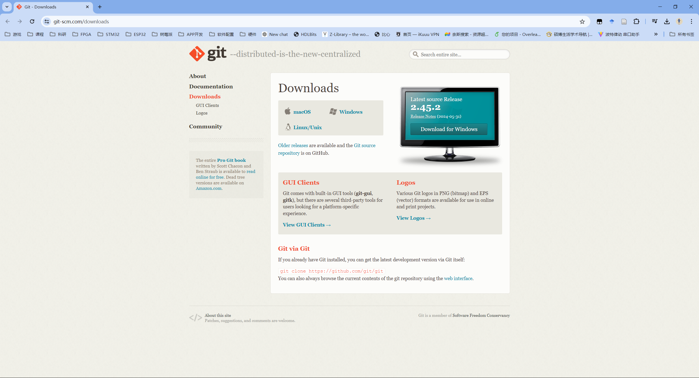

### 1.2 安装过程

略，基本一路 next 即可。本人习惯性将软件安装目录换到 D 盘；Select Components 中，Windows Explorer integration 一定要勾选。

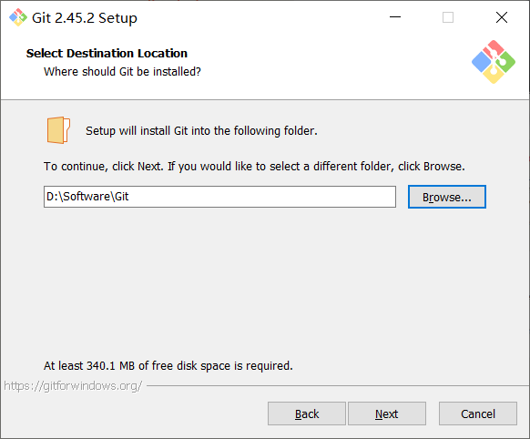

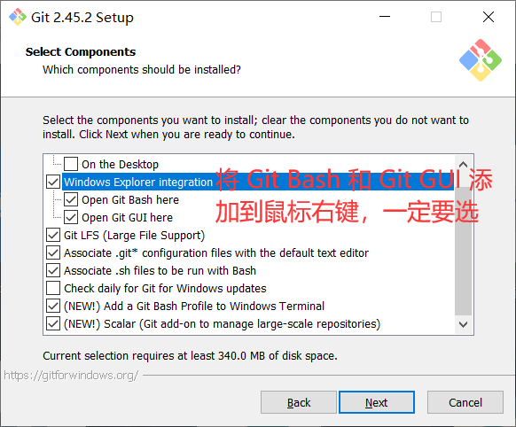

### 1.3 测试 Git 是否安装成功

打开 Git Bash，输入 `git -v`，如果出现版本号说明配置成功。

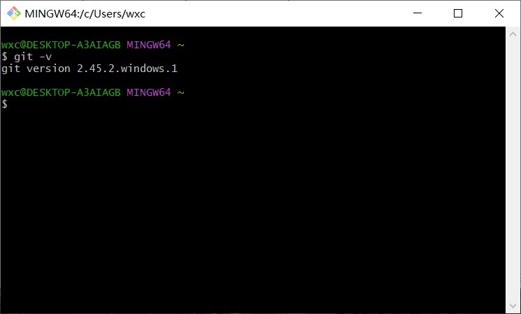


## 2. 安装 Node.js

### 2.1 下载 Node.js 安装包

直接下载安装 [LST (long-term support)](https://nodejs.org/en) 版本，安装的时候一直 next 即可。

### 2.2 测试 Node.js 是否安装成功

安装完后打开 Git Bash，输入`node -v` 和 `npm -v`，如果出现版本号说明配置成功。

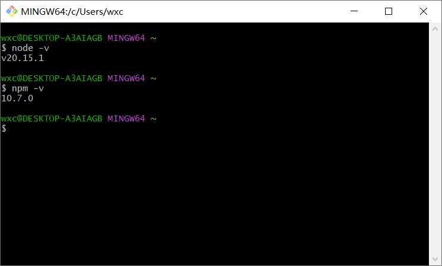

### 2.3 修改依赖包存放路径：

> 默认情况下，我们利用 `npm` 包管理器用来安装依赖包时，包会默认存放在 `C:\Users\用户名\AppData\Roaming\npm\node_modules` 目录下。这样就存在一个问题，如果我们的依赖包很多的情况下，就会占用我们系统盘大量的空间，这时候我们如果不想让全局包放在这里，那么就可以自定义存放目录。修改的方式也很简单，只需要在控制台中执行如下两条命令即可：
>
> ```bash
> npm config set prefix "D:\node\node_global"
> npm config set cache "D:\node\node_cache"
> ```
>
> 代码内地址可修改[^1]

我这里改成了：

```bash
npm config set prefix "D:\Software\nodejs\node_global"
npm config set cache "D:\Software\nodejs\node_cache"
```

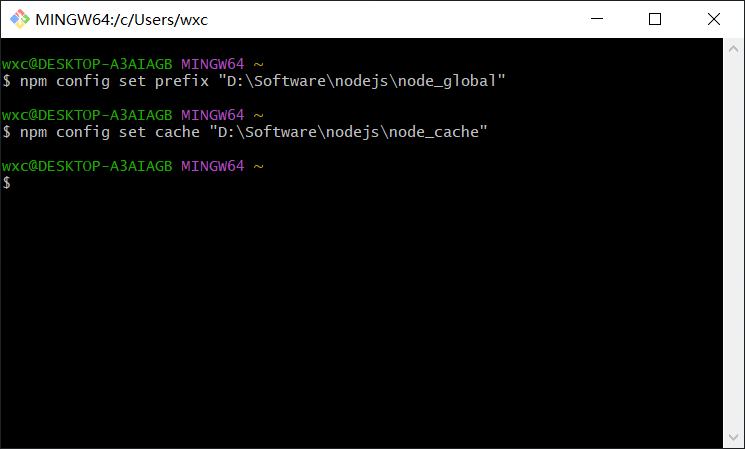

~~然后在 `D:\Software\nodejs` 路径下分别建立 `node_global` 和 `node_cache` 文件夹，注意这一步一定要做，因为在这个目录底下建立 `node_global` 和 `node_cache` 文件夹是需要管理员权限的，如果不提前建立文件夹，在 [4.1.1 全局安装 Hexo 的命令行工具 hexo-cli](# 4.1.1 全局安装 Hexo 的命令行工具 hexo-cli) 这一步中使用 `npm i hexo-cli -g` 时会出现 error，提示npm 在尝试创建 `D:\Software\nodejs\node_global` 目录时，被操作系统拒绝了。~~后来发现既然没有权限，那就直接用管理员身份运行 Git Bash，然后 `cd` 进 Hexo 的目录就好了。不然如果每个文件夹都自己建立，还是很麻烦的（文件夹很多）。故这一步不用做，这里保留内容以供以后参考。

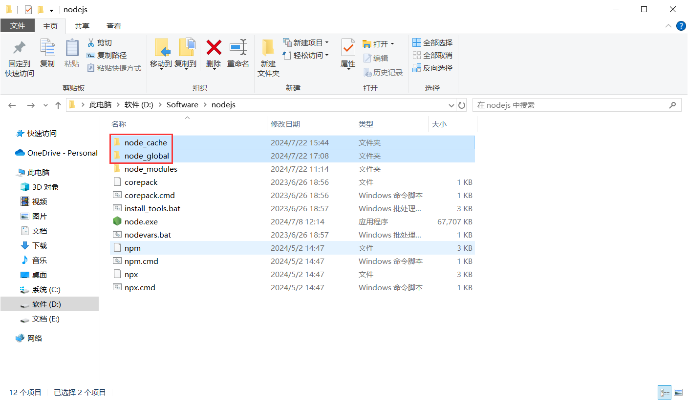

### 2.4 换源
官方源的下载速度较慢，故更换镜像源为淘宝源，加快下载速度。在 Git Bash 中输入：

```bash
# 更换镜像源为淘宝源
npm config set registry https://registry.npmmirror.com

#查看目前使用的镜像源 
npm config get registry
```

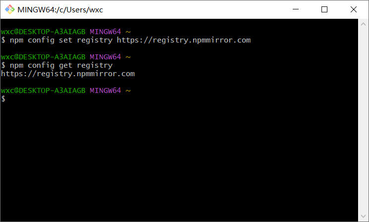

## 3. 注册 GitHub 账号

略。

## 4. 本地Hexo部署

### 4.1 安装Hexo

以管理员身份打开 Git Bash（一定要管理员身份！！！不然 `npm i hexo-cli -g` 和 `npm install` 成功不了），用 `cd` 指令进入 Hexo 文件夹（Hexo 文件夹随便放哪里都可以，我放在了软件的安装目录下），依次输入以下指令：

#### 4.1.1 全局安装 Hexo 的命令行工具 hexo-cli

输入 `npm i hexo-cli -g` 结果如下：

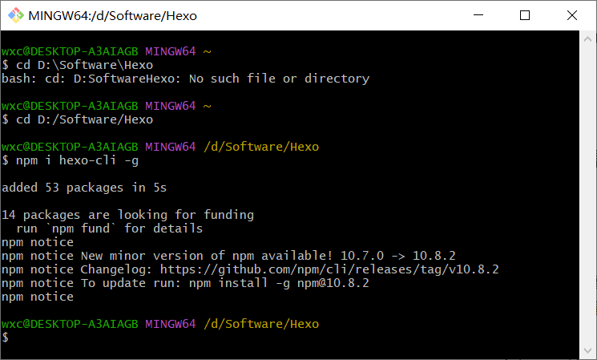

#### 4.1.2 初始化一个新的 Hexo 网站

输入 `hexo init` 时出现了报错 `bash: hexo: command not found`：

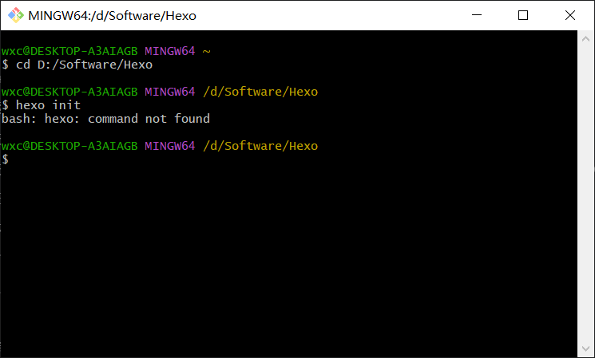

参考了这篇博客[^2]的内容后，发现出现这个报错很有可能是因为没有添加环境变量。使用 `npm root -g` 查看 npm 全局包的安装路径：

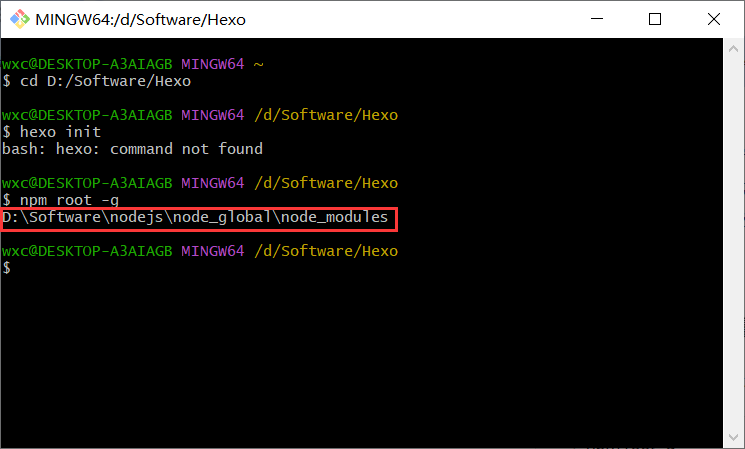

但此时不要将此路径添加至系统环境变量，而是此路径的上一级文件夹：

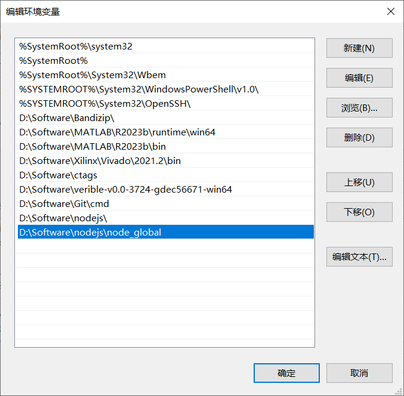

重启 Git Bash（记得用管理员身份运行，其实 `hexo init`应该不用管理员身份也可以使用，但 [4.1.3](# 4.1.3 安装 Node.js 所需的依赖包) 这一步是必须要用的），用 `hexo -v` 测试 Hexo 是否能成功使用，发现没问题了！！！

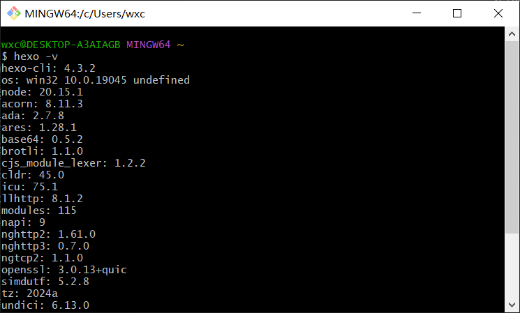

我的理解是，在 [2. 安装 Node.js ](# 2. 安装 Node.js)中的“修改依赖包存放路径”[111](# 修改依赖包存放路径：)里，用 `npm config set prefix "D:\Software\nodejs\node_global"` 把全局包的安装路径换到了 `D:\Software\nodejs\node_global`，所以全局变量必须要加上这个路径。

此时回到 Hexo 文件夹的路径下，输入 `hexo init` 结果如下：

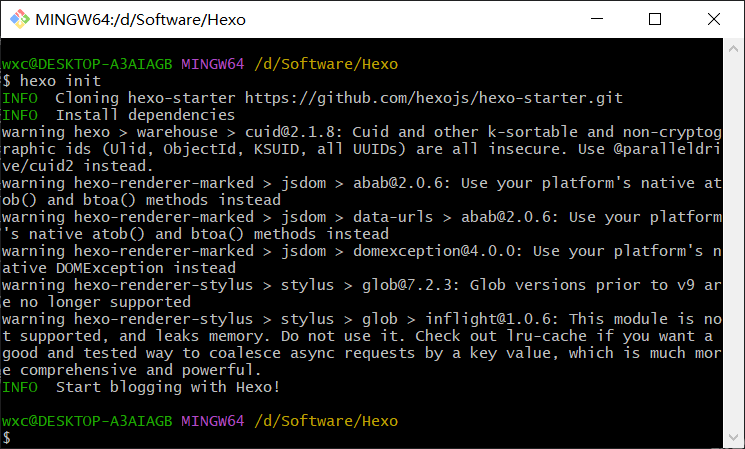

#### 4.1.3 安装 Node.js 所需的依赖包

输入 `npm install` 结果如下（这一步也是一定要先用管理员身份运行 Git Bash）：

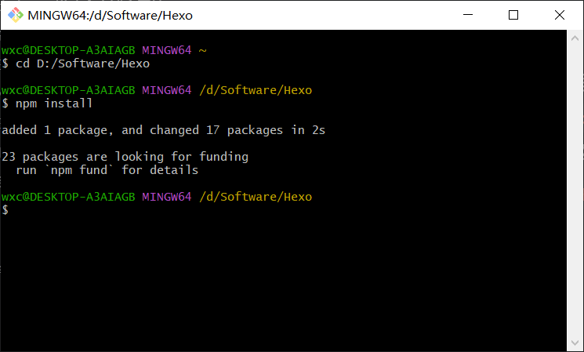


### 4.2 测试页面

#### 4.2.1 生成静态页面并打开本地服务器
输入以下代码：

```bash
# 生成静态页面
hexo g 

# 打开本地服务器
hexo s 
```

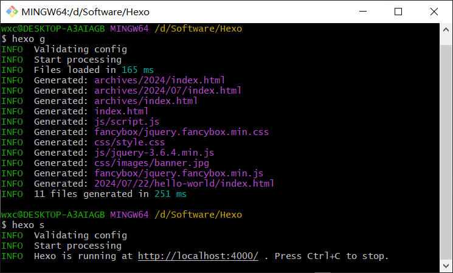

#### 4.2.2 查看博客

打开浏览器，输入 `http://localhost:4000/`，结果如下：

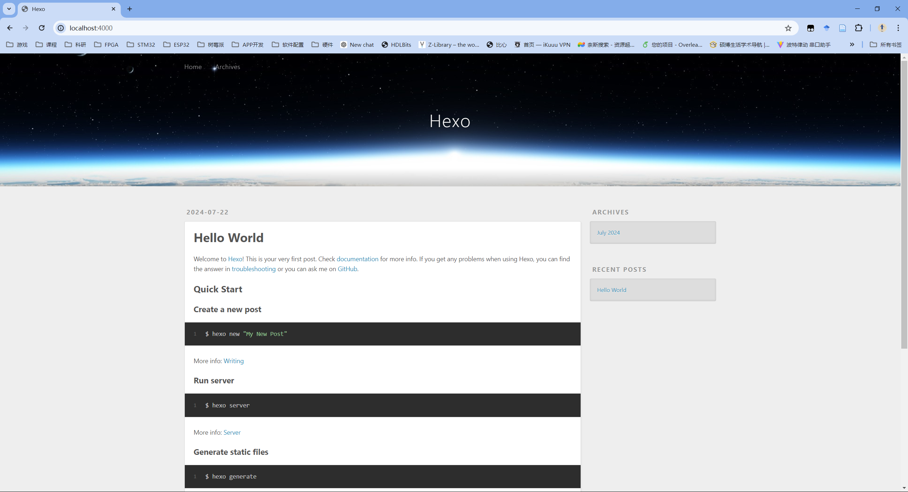

#### 4.2.3 关闭本地服务器

输入 `Ctrl + C` ：

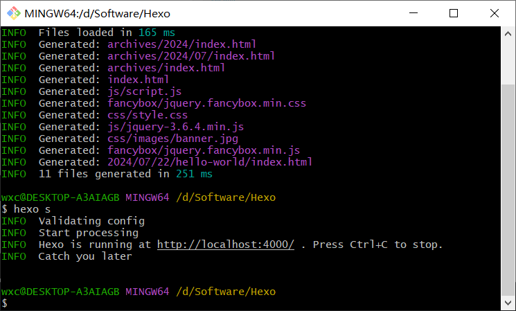

### 4.3 设置主题

#### 4.3.1 安装 Stellar 主题

输入 `npm i hexo-theme-stellar`：

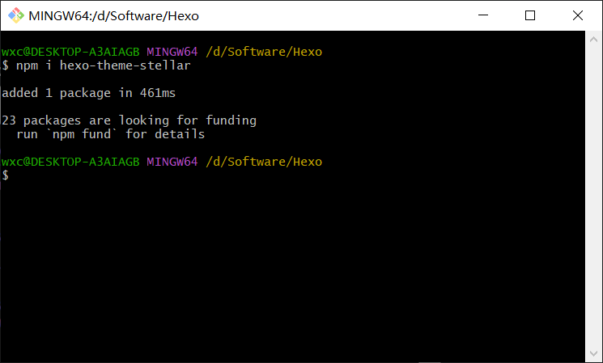

#### 4.3.2 修改 _config.yml 文件

来到 Hexo 文件夹，找到 `_config.yml` 文件，用文本编辑器编辑它。`Ctrl + F` 搜索 `theme` 关键字，找到后将其修改为 `theme: stellar`。

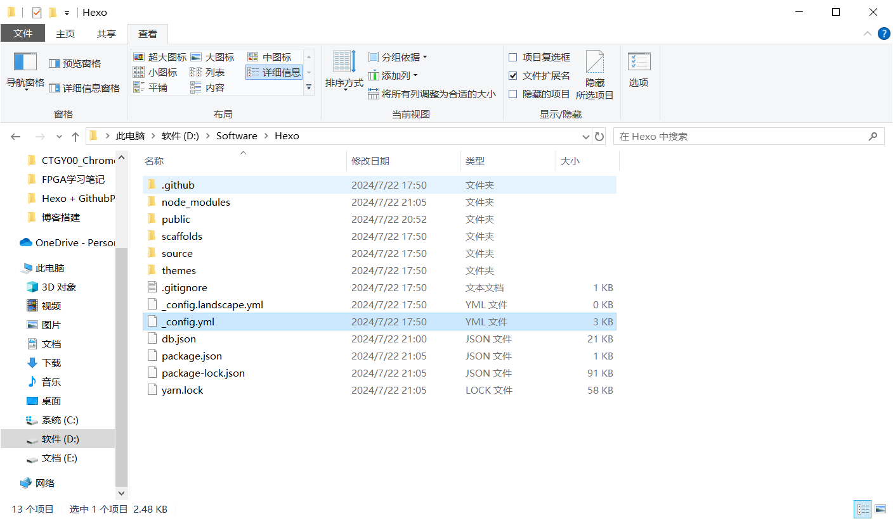

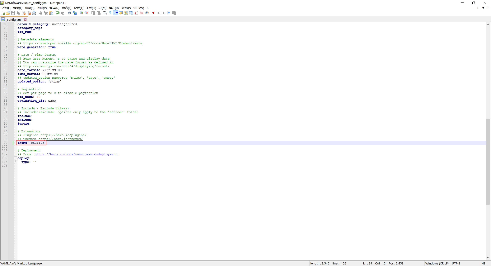

#### 4.3.3 清理缓存、生成静态页面并打开本地服务器

```bash
# 切换主题后需要清理缓存
hexo clean

# 生成静态文件
hexo g 

# 打开本地服务器
hexo s 
```

结果图略，类似[4.2.1 生成静态页面并打开本地服务器](# 4.2.1 生成静态页面并打开本地服务器)。

#### 4.3.4 查看并关闭博客

打开浏览器，输入 `http://localhost:4000/`，结果如下：

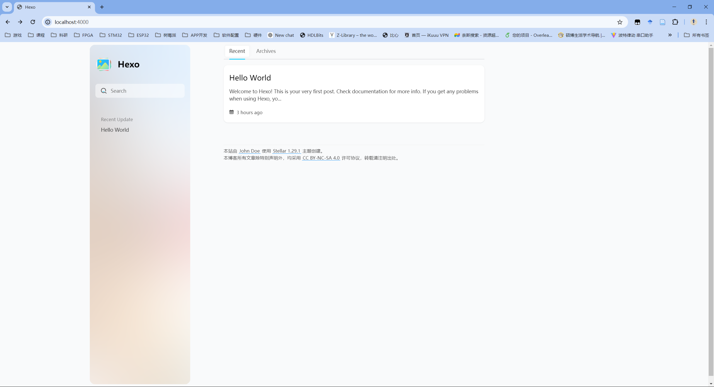

在 Git Bash 中输入 `Ctrl + C` 关闭本地服务器。

## 5. 发布到 GitHub Pages

### 5.1 本地 SSH 密钥

#### 5.1.1 设置 Git 的全局用户名和邮箱

在 Git Bash 中输入以下指令：

```bash
# 配置用户名和邮箱，注意要填自己的 GitHub 用户名和邮箱
git config --global user.name "GitHub 用户名" # 你的 GitHub 用户名
git config --global user.email "GitHub 注册邮箱" # 你的 GitHub 注册邮箱
```

为了保护隐私，这里不放出结果图（其实也没有输出，所以本身就没什么好看的）。

#### 5.1.2 生成 SSH 密钥

输入下面的命令，并连续键入三次回车(即不设置密码)：

```bash
# 生成 ssh 密钥，注意填你自己的 GitHub 邮箱
ssh-keygen -t rsa -C "GitHub 注册邮箱"
```

结果如下：

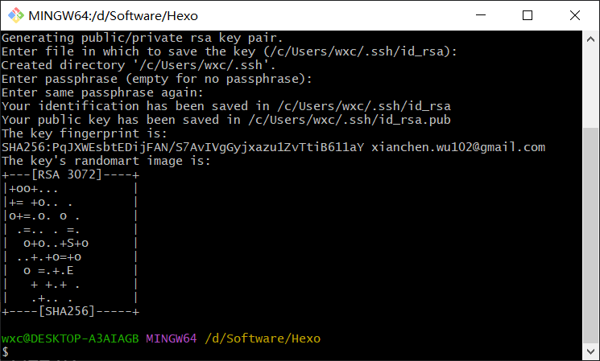

在本地 `C:\Users\用户\.ssh` 目录下，找到 `id_rsa.pub`（公钥），用文本编辑器打开并复制内容（如果没有 `.ssh` 文件夹，可能是被隐藏了，可以试试勾选上面的“隐藏的项目”，但不知道为什么我这里不勾选也有）：

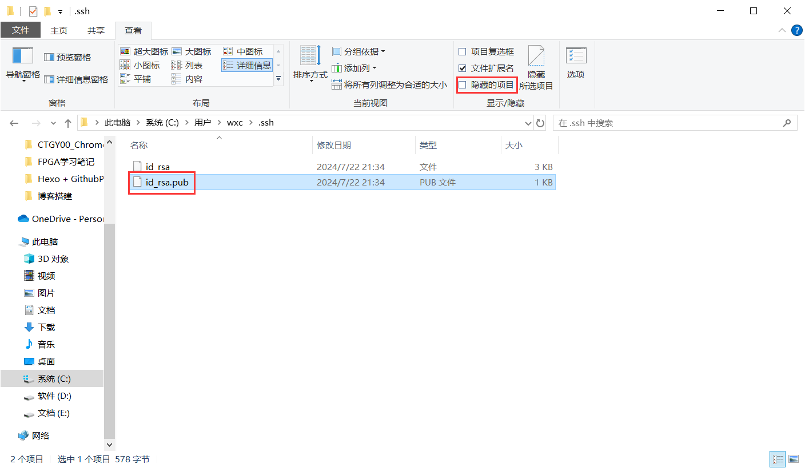

#### 5.1.3 配置远程SSH

打开 GitHub 的 Settings，进入 SSH and GPG keys，点击 

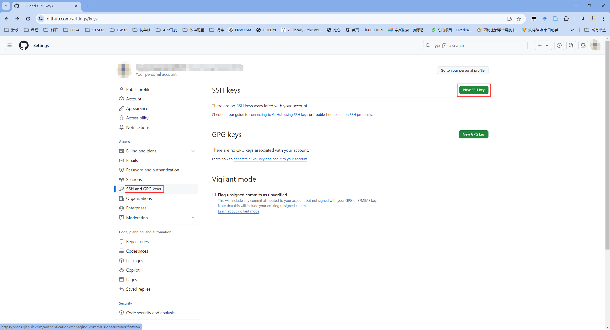

Title 随意，Key 里填写 `id_rsa.pub` 的内容。填写完成后点击 Add SSH key。

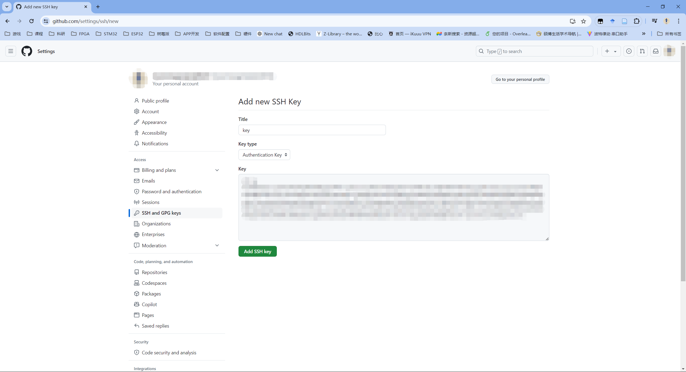

### 5.2 新建 GitHub Pages

进入 [GitHub 官网](https://GitHub.com/)，创建一个仓库，Repository name 一定要设置为 `username.github.io`，`username`就是自己的 GitHub 用户名。

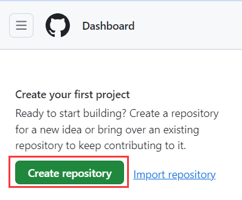

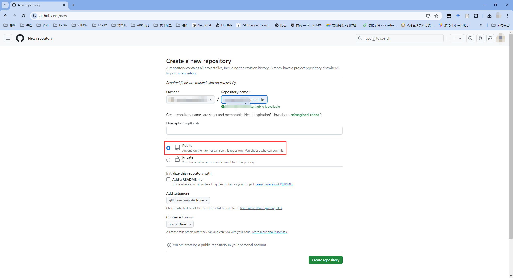

### 5.3 部署博客

#### 5.3.1 安装 Hexo 的 Git 部署器

在 Git Bash 中进入 Hexo 文件夹，输入 `npm install hexo-deployer-git --save` 安装 Git 部署器。

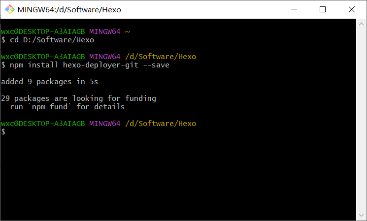

#### 5.3.2 修改配置文件

来到 Hexo 文件夹，找到 `_config.yml` 文件，用文本编辑器编辑它。找到以下内容：

```yaml
# Deployment
## Docs: https://hexo.io/docs/one-command-deployment
deploy:
  type: ''
```

修改为：

```yaml
# Deployment
## Docs: https://hexo.io/docs/one-command-deployment
deploy:
  type: git
  # 这里填入之前在 GitHub 上创建仓库的完整路径
  repo: git@github.com:username/username.github.io.git # username 就是 GitHub 的用户名，这个是 ssh 协议的地址
  branch: master
```

#### 5.3.3 将网站上传到 GitHub Pages

在 Git Bash 中执行一下命令：

```bash
hexo d -g # 生成静态页面，并发布至远程仓库

# 等同于下面这两行代码
#hexo g
#hexo d

# 实际上，按照官网的教程，在运行 hexo d 前要先运行一下 hexo c，但我这里不运行也没出现啥问题，这里提一句作为记录
```

再进入仓库 Settings 的 Pages 界面，做以下修改（选完后记得点 Save）：

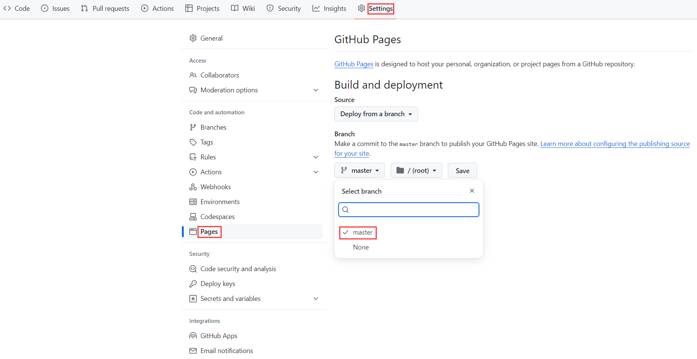

刷新 Pages 页面，会发现出现了 Your site is live at ... 的提示。

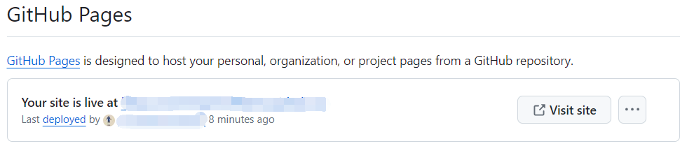

此时打开 `https://username.github.io` 就会发现博客已经部署好，这里就不放展示图啦！

## 6. 个性化配置

### 6.1 更换主题

这里我选择了 [Fluid](https://github.com/fluid-dev/hexo-theme-fluid?tab=readme-ov-file) 主题。进入 `Hexo` 文件夹，打开 Git Bash，运行下面的命令：

```bash
npm install --save hexo-theme-fluid
```

在 `Hexo` 文件夹里创建 `_config.fluid.yml` 文件，然后将 [_config.yml](https://github.com/fluid-dev/hexo-theme-fluid/blob/master/_config.yml) 里的内容复制进去。

打开 `_config.yml` 文件，修改 `theme` 为 `theme: fluid`，修改 `language` 为 `language: zh-CN`。

在 Git Bash 中进入 `Hexo` 文件夹，运行下面的命令：

```bash
hexo clean
hexo d -g
```

进入博客的页面，发现主题已经改变（可能有一段时间的延迟）。

剩下的配置还有很多，但 Fluid 的手册里已经阐述的非常详细了，这里不再赘述，详见 [Hexo Fluid 用户手册](https://hexo.fluid-dev.com/docs/)[^5]。

### 6.2 多端同步博客

我遇到了这样的情况：我的博客环境搭建在实验室的主机上，但我有时候想在自己的笔记本上修改博客，这个时候就涉及到了多端同步的问题。

在参考了一些资料[^6][^7]后，我觉得可以这么做：

打开 Hexo 的那个仓库，本来应该只有 master 这个分支的，这个时候建立一个 hexo 分支，并把 hexo 分支设置为默认分支。

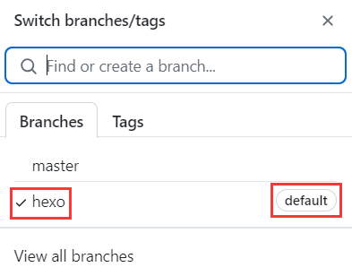

假设实验室的主机是 A，我的笔记本是 B。

先在 A 进行操作。首先新建一个文件夹 `temp`，在这个目录下打开 Git Bash，输入：
```bash
git clone git@github.com:username/username.github.io.git
```

clone成功后，删掉除去 `.git` 之外的所有文件夹。然后把 `Hexo` 目录下所有文件复制到 `temp` 文件夹，删除 `.deploy_git`。

新建或者修改 `.gitignore` 文件：
```.gitignore
.DS_Store
Thumbs.db
db.json
*.log
node_modules/
public/
.deploy*/
```

***注意：***

> 如果你在`themes`文件夹下 clone 过其它主题文件，把其中的 `.git`文件夹删除掉[^6]

但我是用 `npm` 指令安装的主题，所以不存在这个问题。

然后上传文件到 hexo 分支：

```bash
git add .
git commit -m "backup blog source file0305"
git push 
```

A 上的配置操作暂时结束。

接着在 B 上操作。首先 安装 Git，Node.js， Hexo 这些，还有一些基础设置比如设置 Git 的全局用户名和邮箱，这些全部搞好。

然后进入这台电脑的 `Hexo` 文件夹，clone 仓库：

```bash
git clone git@github.com:username/username.github.io.git
```

clone 成功后，在 `Hexo` 目录下安装依赖包：

```bash
npm install
```

B 上的操作结束。

现在就可以在 B 上写博客了，写完后记得同步到仓库然后再更新博客网站：

```bash
# 多台终端写博客，记得先和 GitHub 端同步，当然如果是第一次刚刚配置完就不用做这一步，但只要别的终端更新过博客，就必须要做这一步
git pull

# 同步到仓库
git add .
git commit -m "..." # 可以写日期或者其他的
git push 

# 更新博客网站
hexo clean
hexo d -g
```

再回到 A，此时还要把 A 上本来的 `Hexo` 文件夹关联到仓库的 hexo 分支。但这里我做的稀里糊涂的（主要还是对 Git 的用法不熟），所以直接放步骤了。

进入 `Hexo` 文件夹，打开 Git Bash，输入如下命令：

```bash
git init
git remote add origin git@github.com:username/username.github.io.git
git clone git@github.com:morningmist42672/morningmist42672.github.io.git
```

这个时候 `Hexo` 目录底下会有一个 `morningmist42672.github.io` 文件夹，用这个文件夹里的全部文件覆盖 `Hexo` 文件夹里的同名文件。

然后回到 Git Bash，输入以下命令：

```bash
git checkout hexo # 如果已经在 hexo 分支下就不用输入这个命令，但一般情况下应该都不在

# 同步到仓库
git add .
git commit -m "..." # 可以写日期或者其他的
git push 
```

然后以后不管是在 A 还是在 B，亦或是以后还有 C，反正都是先把仓库的最新版本同步到本地，然后写博客，然后再上传到仓库，最后再发布博客。发布放在最后是一个好习惯，如果先发布博客，但发布后因为电脑突然出问题或者什么别的原因（概率极低，但还是有概率）导致没有上传仓库，那么最新版本的 `.md` 文件将丢失。想上传仓库则绝对不会有这个问题。

### 6.3 不让搜索引擎搜索到你的博客

***注意：存疑，ChatGPT 提供的方法，不知真假；两种方法用一种就可以，当然都用更保险。***

#### 6.3.1 使用 robots.txt 文件禁止搜索引擎抓取

进入 `Hexo/source` 路径，创建 `robots.txt` 文件，填入一下内容：

```plaintext
User-agent: *
Disallow: /
```

#### 6.3.2 在页面中添加noindex元标签

***注意：我使用了 git 进行 Hexo 的多端同步（详见 [6.2 多端同步博客](# 6.2 多端同步博客)）,使用这种方法进行的修改，是无法被 git 同步的（因为修改的是主题文件，使用 `npm` 安装的主题，包会放在 `Hexo/node_modules` 下，这个目录是不会同步的），所以每在一台新电脑上创建一个 Hexo 终端，就要重新做一次这个操作，切记。***

进入 `Hexo/node_modules/你的主题/layout/_partial`，打开 `head.ejs` 文件，在 `<head>` 部分添加以下元标签：
```html
<meta name="robots" content="noindex, nofollow">
```

~~但很奇怪，我使用的 butterfly 主题并没有 `head.ejs` 文件，问了一下 ChatGPT，他让我这么操作：进入 `Hexo/node_modules/hexo-theme-butterfly/layout/includes`，打开 `head.pug` 文件，修改以下内容：~~这么做不行，`hexo g` 时会报错，暂时放弃这一步吧。

```pug
meta(charset='UTF-8')
meta(http-equiv="X-UA-Compatible" content="IE=edge")
meta(name="viewport" content="width=device-width, initial-scale=1.0,viewport-fit=cover")
meta(name="robots" content="noindex, nofollow")  // 添加这一行
title= tabTitle
meta(name="author" content=pageAuthor)
meta(name="copyright" content=pageCopyright)
meta(name ="format-detection" content="telephone=no")
meta(name="theme-color" content=themeColor)
```

完成！

## 参考资料

[^1]:[【2024】从零开始用Hexo+GitHub Pages搭建个人网站（保姆级）](https://zhuanlan.zhihu.com/p/688561305)：搭建过程主要来自于这篇博客。
[^2]:[解决npm安装Hexo时出现的'bash: hexo: command not found'问题](https://cloud.baidu.com/article/3284918)：解决了 bash: hexo: command not found 的报错。
[^3]:[Hexo教程，看这一篇就够了- How to系列](https://blog.csdn.net/cat_bayi/article/details/128725230)：看这篇博客学了更换主题和一些 Hexo 的基本操作，可以对照着[^1]一起看。
[^4]:[hexo-theme-fluid](https://github.com/fluid-dev/hexo-theme-fluid)：Fluid 的 GitHub 官网。
[^5]:[Hexo Fluid 用户手册](https://hexo.fluid-dev.com/docs/)：Hexo Fluid 的官方用户手册，对着这个可以完成 Fluid 主题的基本配置。
[^6]:[Hexo搭建博客的多终端同步问题](https://zhuanlan.zhihu.com/p/476603074)：
[^7]:[使用hexo，如果换了电脑怎么更新博客？](https://www.zhihu.com/question/21193762)：
