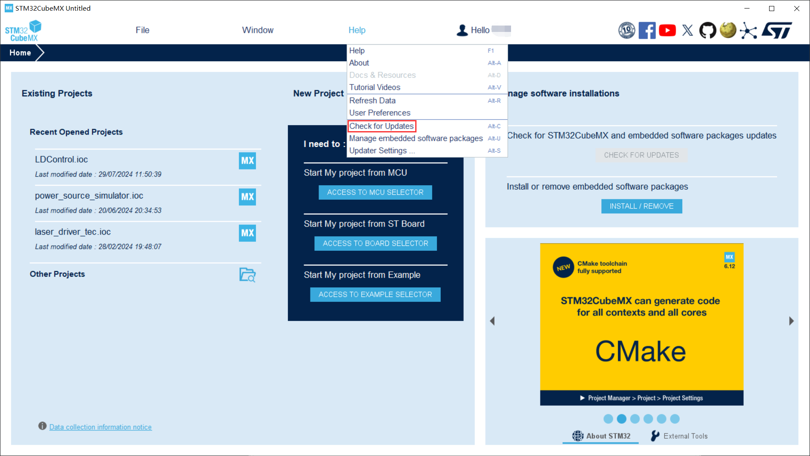
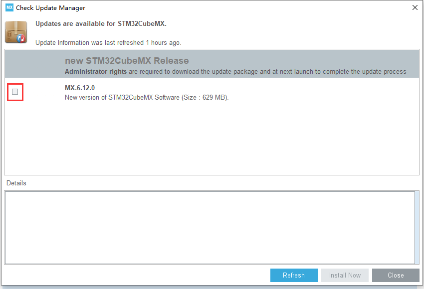
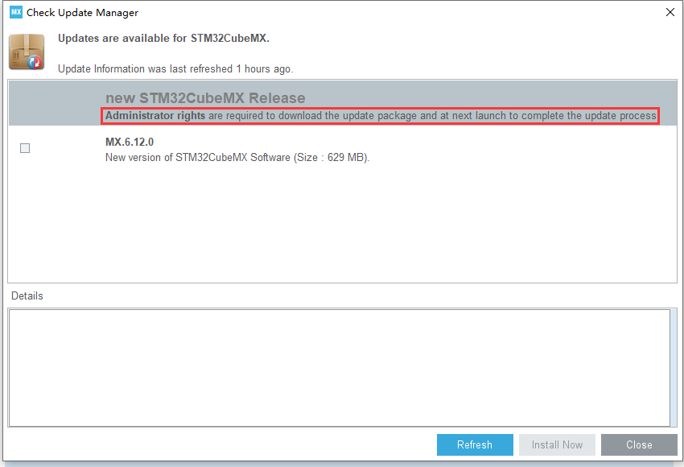

## 0. 系统说明及软硬件平台

操作系统：Windows 10 22H2

软件版本：

- 旧的 STM32CubeMX 版本：Version 6.3.0
- 目标 STM32CubeMX 版本：Version 6.12.0

## 1. 问题

同事的 STM32CubeMX 的版本比我的高，导致我无法打开他的工程，于是准备升级我的 STM32CubeMX。

打开 STM32CubeMX，进入更新页面。

但发现这个复选框不能勾选：

## 2. 解决方法

其实这里明确说了，下载更新包是需要 ***管理员权限*** 的，所以直接以管理员身份运行 STM32CubeMX，然后就会发现这个复选框可以勾选了。

