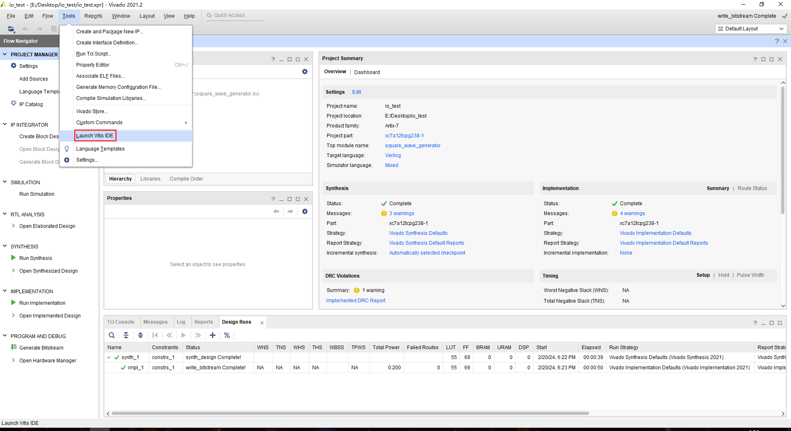
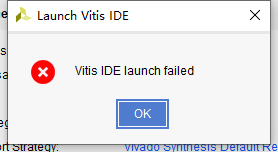
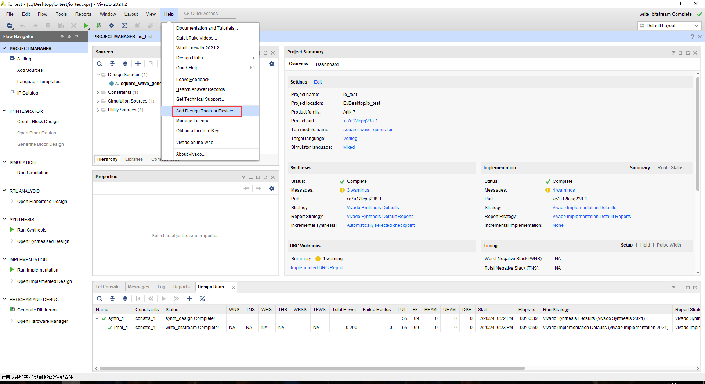
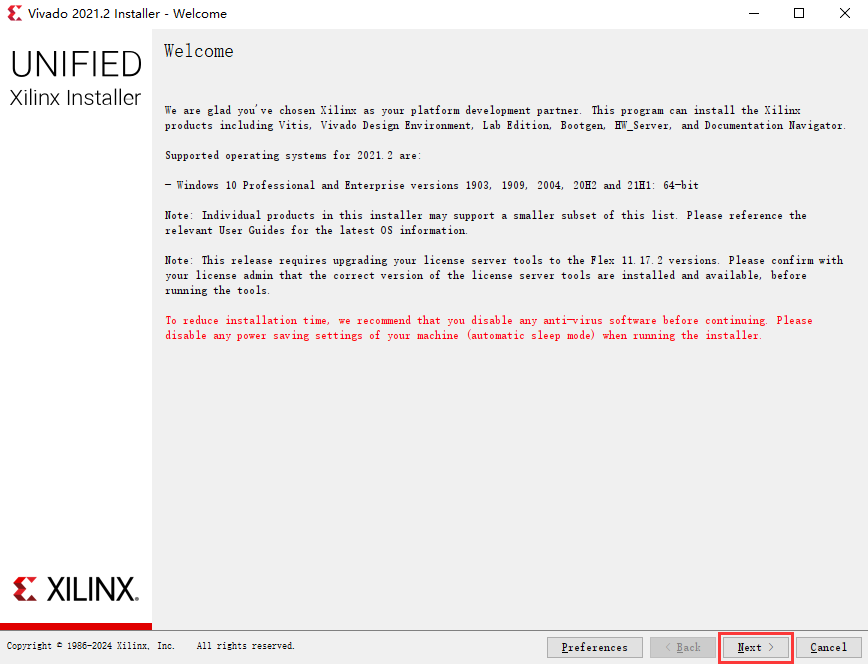
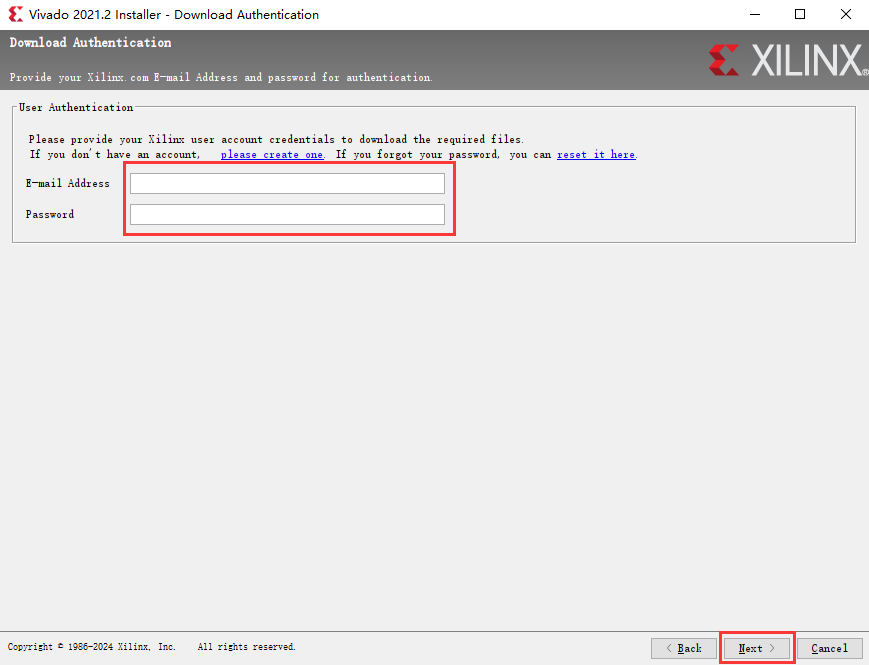
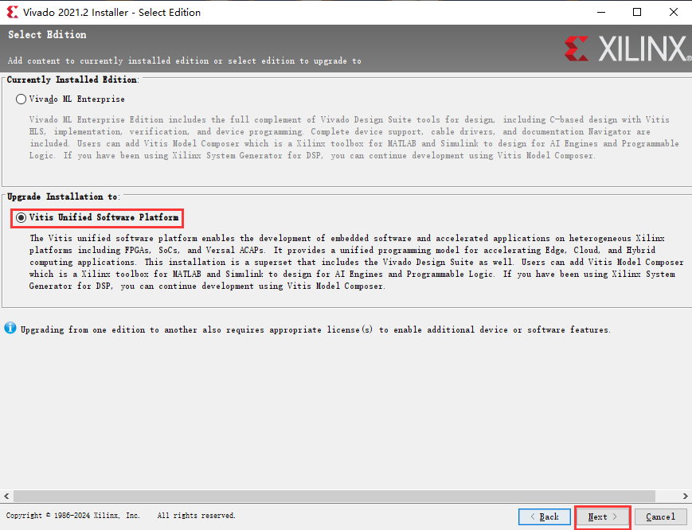
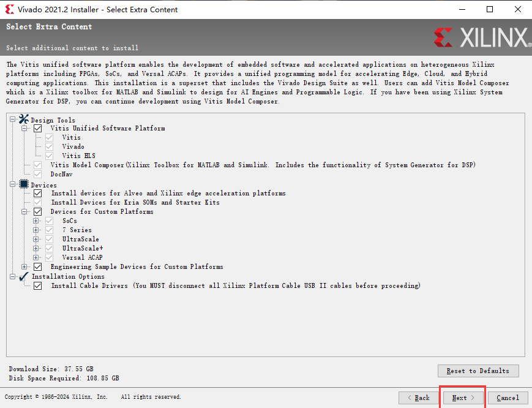
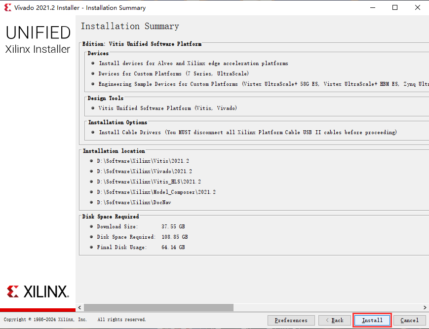
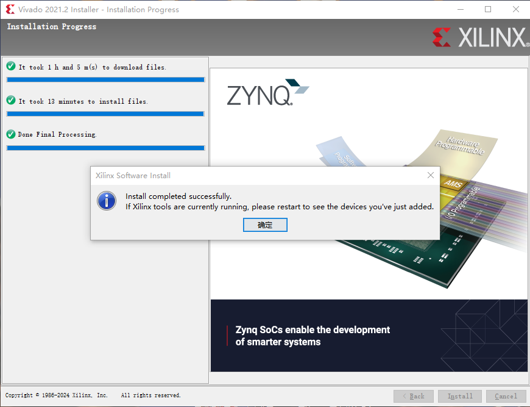

## 0. 系统说明及软硬件平台

操作系统：Windows 10 22H2

软件版本：

- Vivado 2021.2
- Vitis 2021.2

## 1. 问题

学习 Zynq 开发时，兴冲冲地配置好了 Vivado 工程，准备打开 Vitis 进行软件部分的设计 。

然后发现出现以下报错：

## 2. 解决方案

经过一番研究，发现是因为本来就没有装 Vitis 导致的这个问题。这里解释一下，Vitis 和 Vitis HLS 是两个不同的东西，Vitis 是用来针对处理器进行软件开发的，而 Vitis HLS 是用高层次语言（如 C / C++）为 PL（Programmable Logic）设计 IP 核，详情可以参考这篇帖子 [Vitis vs Vitis HLS](https://support.xilinx.com/s/question/0D52E00006hpQc8SAE/vitis-vs-vitis-hls?language=en_US)[^1]。这里吐槽一下 Xilinx（现在应该叫 AMD Xilinx）的命名策略，误导性太强了(＃￣～￣＃)。

下面来安装 Vitis，首先打开 Vivado，进入下载界面：

这里输入以下自己的 AMD Xilinx 账号，没有的可以注册一个。

选择 Upgrade Installation to 的 Vitis Unified Software Platform，然后 next。

为了防止后面再次出现需要安装新工具或器件的情况，我勾选了所有的选项。

看一下信息确认页面，确定没问题了就可以直接安装了。

下载过程非常恶心，经常出现断连或者速度极慢的情况，建议采取以下措施：

- 挂着梯子，当然非常耗流量，但又能怎么办呢╮(╯▽╰)╭。
- 关闭电脑的睡眠，具体怎么关搜一下就有很多，这里不再赘述。
- 尽量一直坐在电脑前守候着下载进程，出问题了还能及时补救一下，比如有时候下载失败了是需要手动点 Retry 的。

当然就算这几点都做到了还是有可能下载失败，耐着性子多试几次吧。

还有一件事很奇怪，我在实验室的主机上，挂着这个下载进程一晚就下载好了，但在我自己的笔记本上试了好几次才成功下完，目前不知道原因是什么。不过我笔记本的配置比实验室主机差了很多，不知道这个有没有影响，暂不深究。

完成！

## 参考资料

[^1]:[Vitis vs Vitis HLS](https://support.xilinx.com/s/question/0D52E00006hpQc8SAE/vitis-vs-vitis-hls?language=en_US)
