## 1. 安装 Vivado 和 VSCode
过程略。

## 2. 将 VSCode 设置为 Vivado 的默认代码编辑器。
打开 Vivado，进入 Settings 页面。

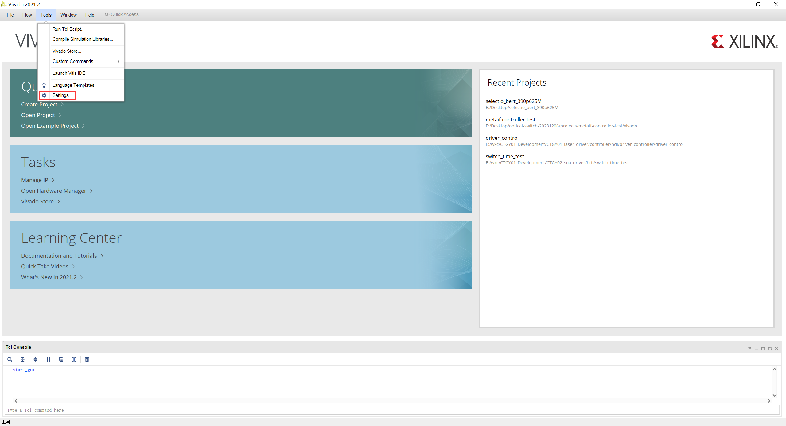

Text Editor  -->  Current Editor 的下拉列表 --> 选择 Custom Editor... --> ...

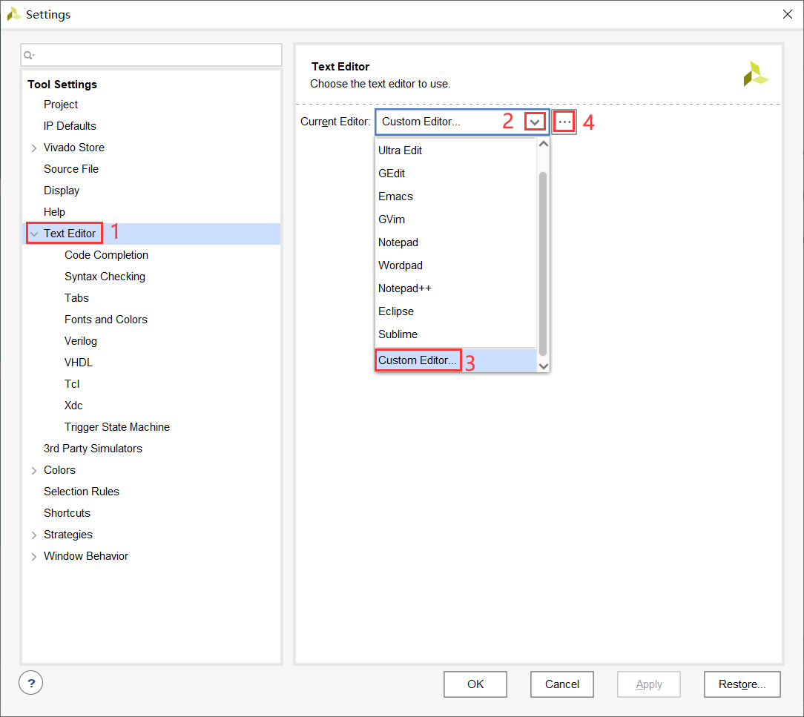

在 Editor 中输入 `cmd /S /k "code -g [file name]:[line number]"`，点击 OK。

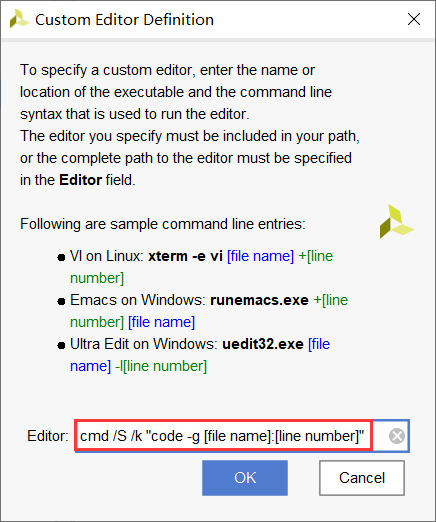

随便打开一个工程，双击需要打开的文件。

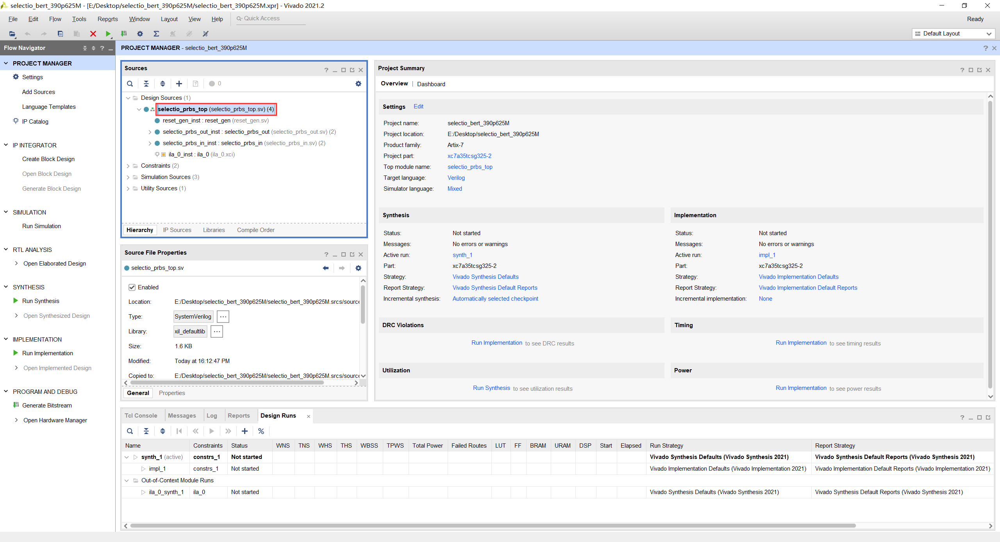

成功在 VSCode 中打开文件。

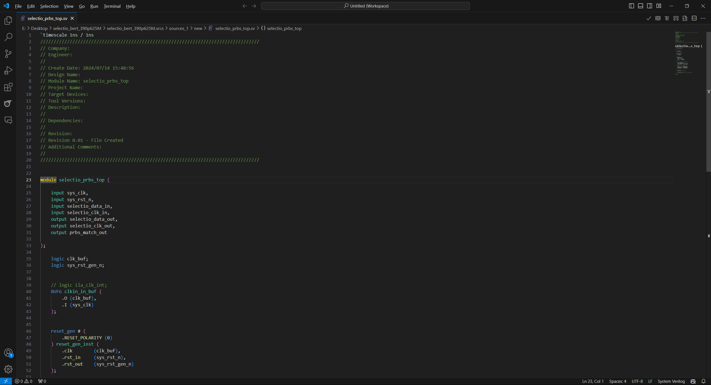

## 3. 安装 Verilog / SystemVerilog 插件，并拓展其功能。

### 3.1 安装插件
打开 VSCode --> Extensions --> 搜索 verilog --> 选择红框标记的这个插件，我这里是已经装好的状态，未安装状态下会像其他插件一样，有个 Install 的按钮，点一下即可安装。

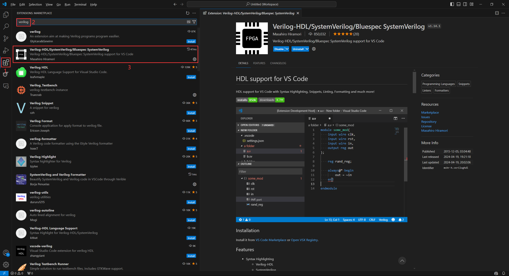

### 3.2 代码实时纠错：

快捷键 `Win + I` 打开 Windows 设置 --> 搜索 “环境变量” --> 编辑系统环境变量。

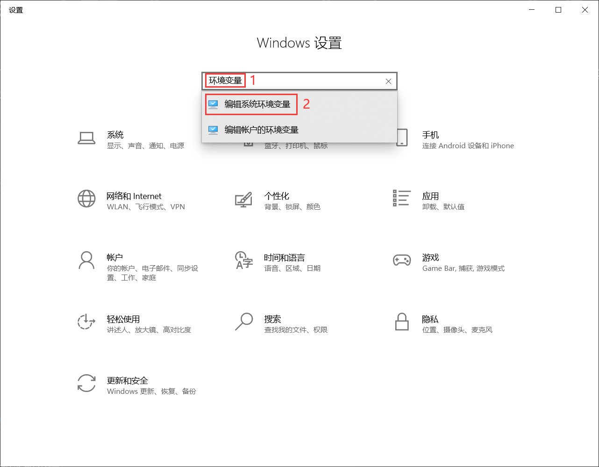

点击 “环境变量”。

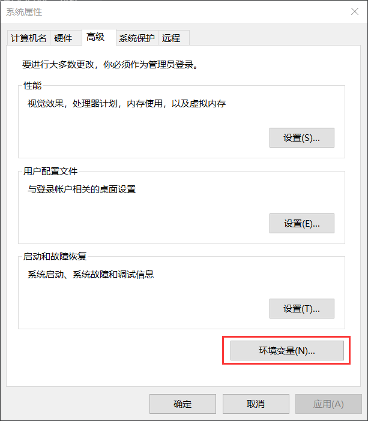

选中系统变量中的 Path，点击编辑。

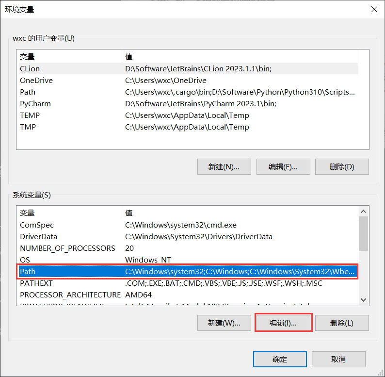

添加 Vivado 的安装路径。

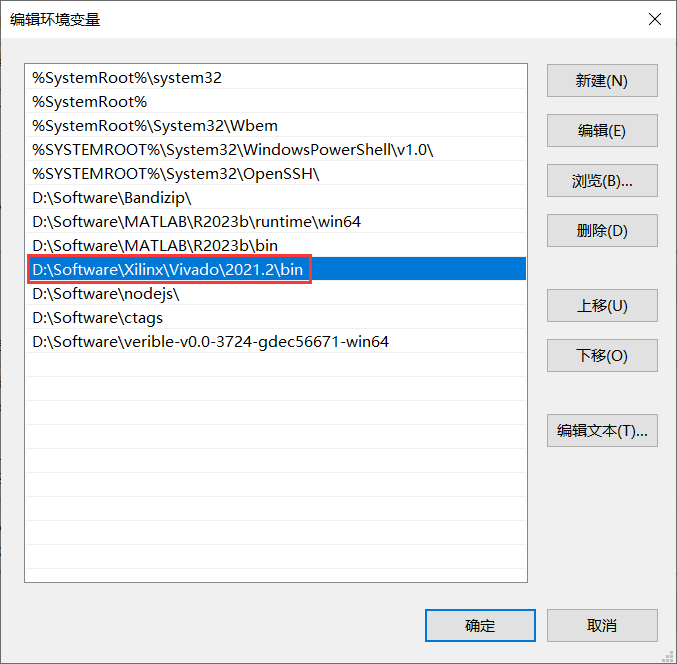

由于本人暂且没有完全搞懂 “系统变量” 和 “用户变量” 的本质区别，所以在 “用户变量” 中执行了与上一步相同的操作。

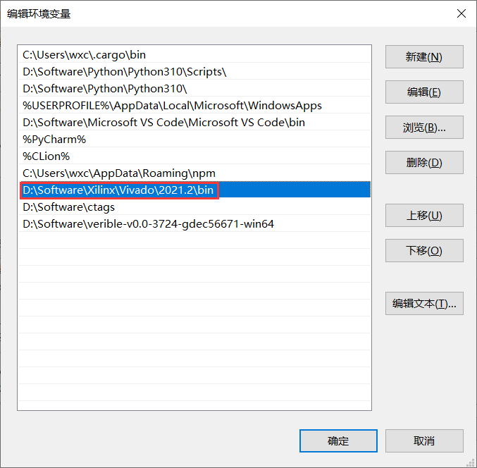

回到 VSCode，使用快捷键 `Ctrl + ,` 打开 Settings --> 搜索 verilog --> 在 "Verilog > Linting: Linter" 中选择 xvlog。

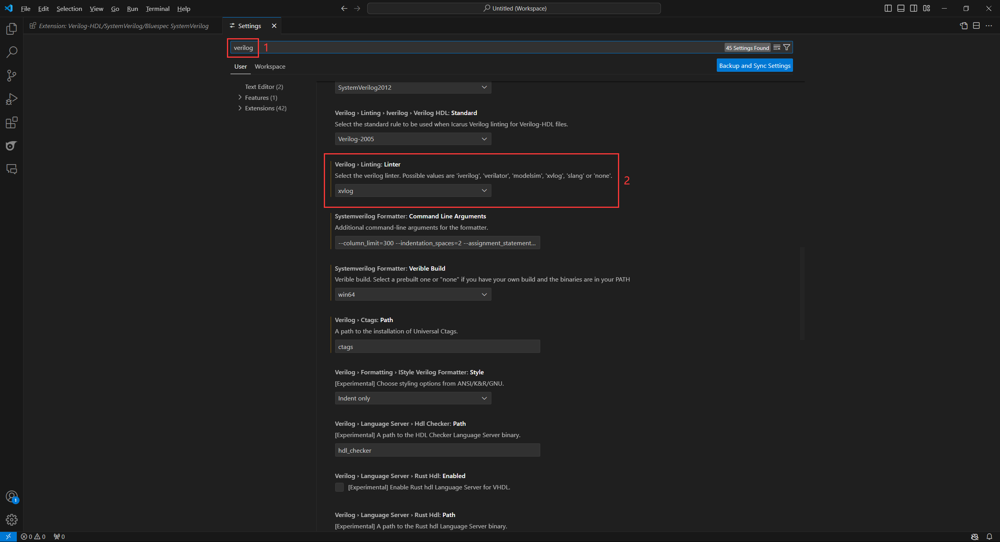

完成！

### 3. 定义跳转：

下载 ctags: [universal-ctags / ctags-win32](https://github.com/universal-ctags/ctags-win32/releases)

解压在电脑上，目录随意，不过按照习惯建议路径中不要有中文。下图是我放的位置。

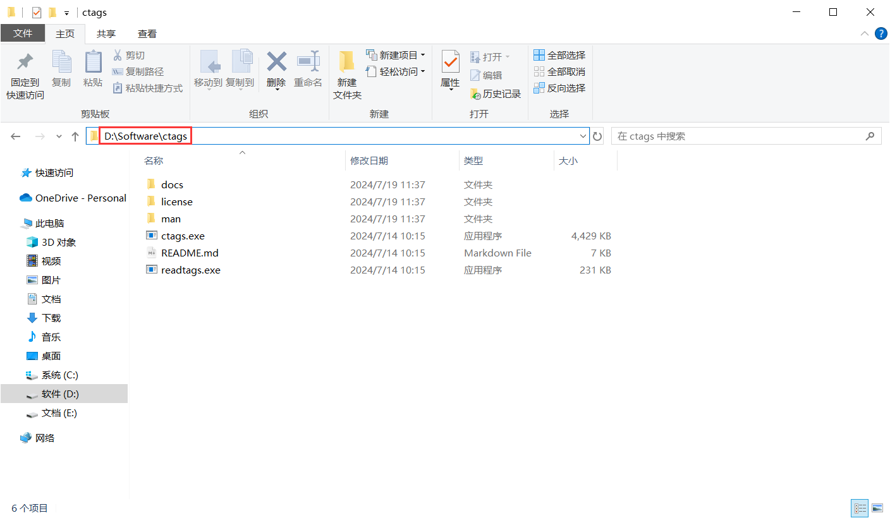

将 ctags 的目录添加到环境变量中（此处不在赘述，详细方法见上文中[代码实时纠错](# 2. 代码实时纠错：)部分。结果如下：

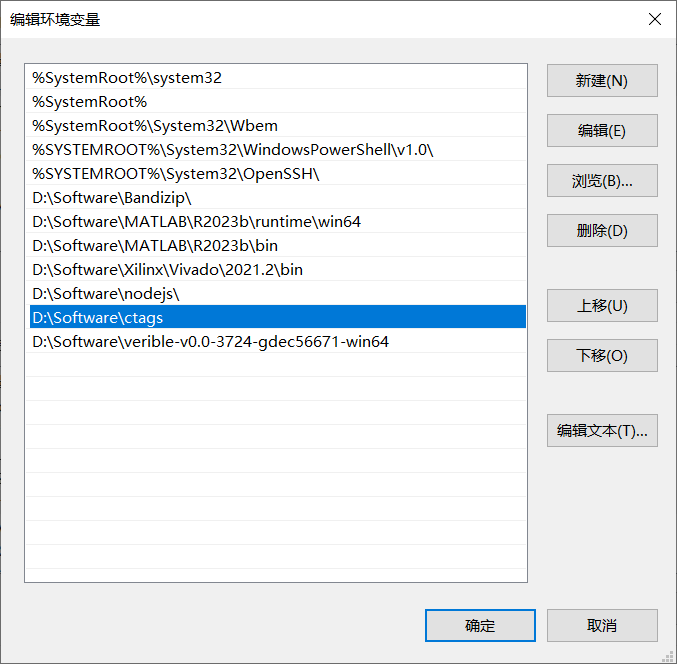

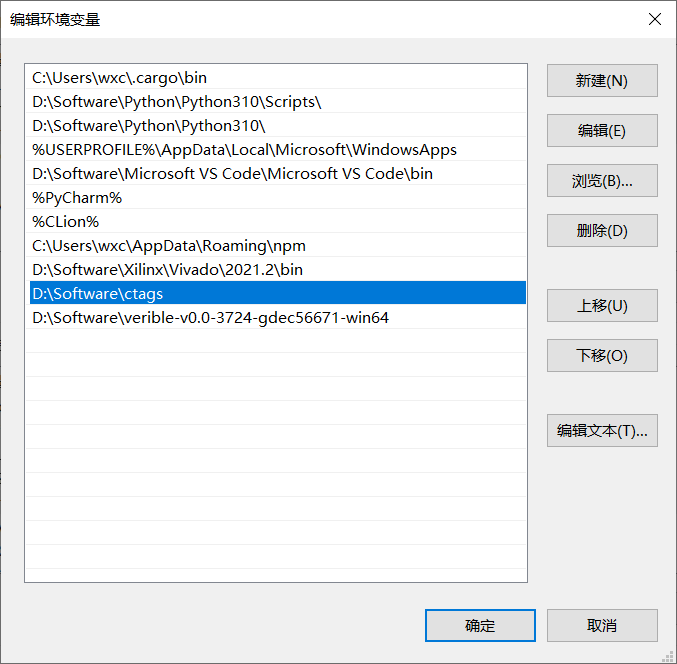

回到 VSCode，使用快捷键 `Ctrl + ,` 打开 Settings --> 搜索 verilog --> 在 "Verilog > Ctags: Path" 中填写 `ctags`。

完成！

***注意***：要使用 ctags 的定义跳转的功能，一定要先创建工作区！！！

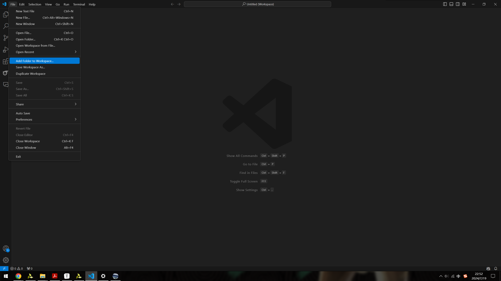

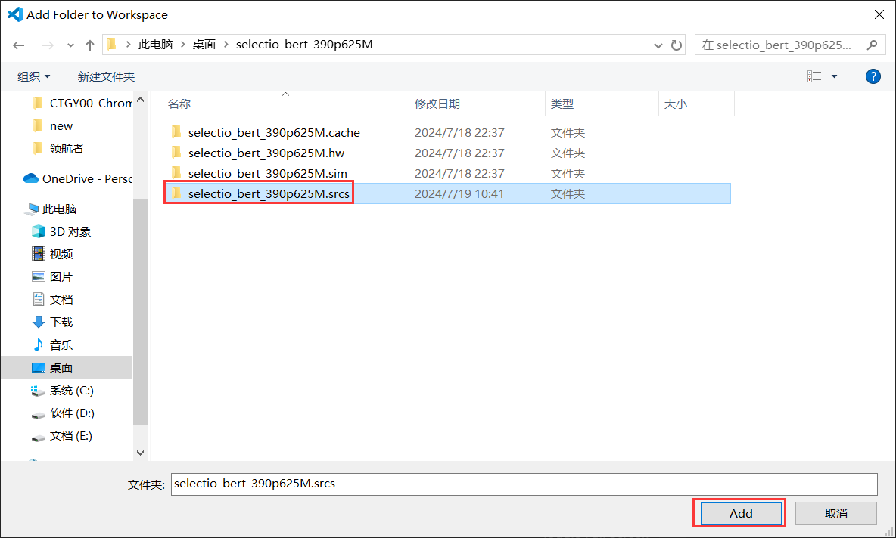

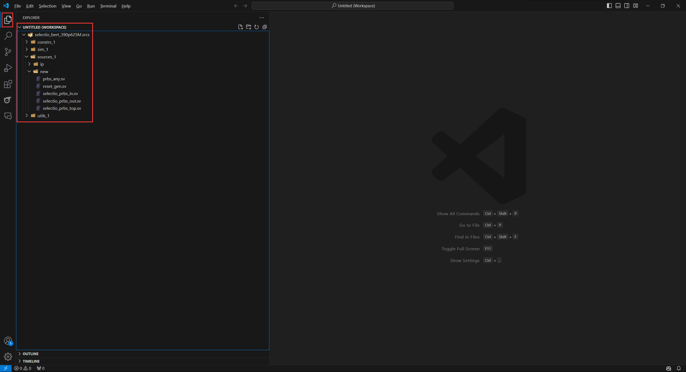

## 4. 待补充

## 5.

## 参考资料：

[^1]:[VScode配合Vivado的FPGA开发环境设置的教程](https://www.bilibili.com/read/cv34148140/?jump_opus=1)：修改 Vivado 默认编辑器的步骤需要给 Custom Editor Definition 里的 Editor 输入一串代码，这个博客中的代码是不可用的，按照我自己写的来。
[^2]:[Vivado 打不开 VSCode 如何解决](https://support.xilinx.com/s/question/0D52E00006hpllISAQ/i-cant-get-vivado-to-open-vscode-as-a-custom-editor?language=en_US&t=1680960017474)：可以解决参考资料 [1] 中的问题。
[^3]:[FPGA终于可以愉快地写代码了！Vivado和Visual Studio Code黄金搭档](https://zhuanlan.zhihu.com/p/622356787)
[^4]:
